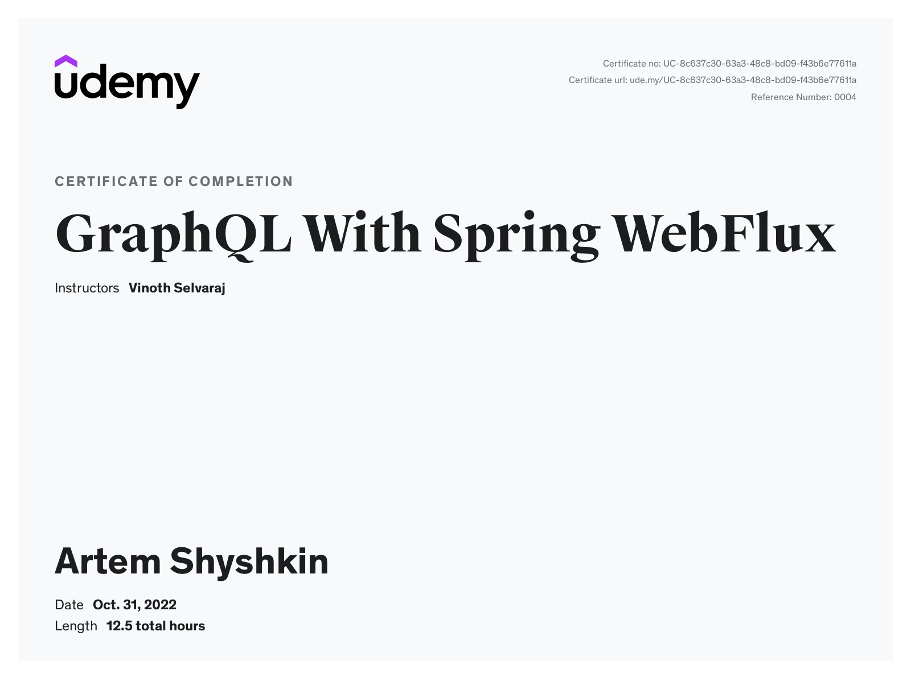

[](https://circleci.com/gh/artshishkin/art-vinsguru-graphql)
[](https://codecov.io/gh/artshishkin/art-vinsguru-graphql)
[](https://github.com/artshishkin/art-vinsguru-graphql/actions/workflows/maven.yml)

![GraphQL][graphql]

![Docker][docker]
![Testcontainers version][testcontainersver]
![Keycloak Container][keycloak-container-ver]
![PostgreSQL Container][postgres-container-ver]

[](https://github.com/artshishkin/art-vinsguru-graphql/issues)
![Spring Boot version][springver]
![Project licence][licence]

# art-vinsguru-graphql
Tutorial - GraphQL With Spring WebFlux - from Vinoth Selvaraj (Udemy)

---
#### Section 10: Movie Application with GraphQL

External Services
- Run `docker-compose up`
- Swagger-UI [http://localhost:8081/swagger-ui/](http://localhost:8081/swagger-ui/)

---
####  GraphQL Security with Keycloak
- [Configure Keycloak](/instructions/configure-keycloak.md)

---

#### Helpful merge command

Merge without rename detection. It is helpful to two versions of renamed files (like tests for example)  

```git
git merge -s recursive -Xno-renames clientside-loadbalance
```

---
### _Certificate of Completion_



[springver]: https://img.shields.io/badge/dynamic/xml?label=Spring%20Boot&query=%2F%2A%5Blocal-name%28%29%3D%27project%27%5D%2F%2A%5Blocal-name%28%29%3D%27parent%27%5D%2F%2A%5Blocal-name%28%29%3D%27version%27%5D&url=https%3A%2F%2Fraw.githubusercontent.com%2Fartshishkin%2Fart-vinsguru-graphql%2Fmain%2Fpom.xml&logo=Spring&labelColor=white&color=grey
[licence]: https://img.shields.io/github/license/artshishkin/art-vinsguru-graphql.svg
[graphql]: https://img.shields.io/static/v1?label=&message=GraphQL&labelColor=grey&color=white&cacheSeconds=60&logo=graphql
[docker]: https://img.shields.io/static/v1?label=&message=Docker&labelColor=white&color=white&logo=docker
[testcontainersver]: https://img.shields.io/badge/dynamic/xml?label=Testcontainers&query=%2F%2A%5Blocal-name%28%29%3D%27project%27%5D%2F%2A%5Blocal-name%28%29%3D%27properties%27%5D%2F%2A%5Blocal-name%28%29%3D%27testcontainers.version%27%5D&url=https%3A%2F%2Fraw.githubusercontent.com%2Fartshishkin%2Fart-vinsguru-graphql%2Fmain%2Fpom.xml&logo=data:image/png;base64,iVBORw0KGgoAAAANSUhEUgAAAB4AAAAjCAIAAAAMti2GAAAAAXNSR0IArs4c6QAAAARnQU1BAACxjwv8YQUAAAAJcEhZcwAAEnQAABJ0Ad5mH3gAAAPCSURBVEhL7ZZNbBRlGMffj9nZabddtqW1yldDoSUSP1ICaoKlUJtw0BDTNCQcOBDjxSOnxpvGaLhw9KYSLxxAOGDCQa1iNBFogYCBdLds60KXfmw3W9idz/fDZ3bGsl1md6cYb/4Om5ln3uf/Pvt/n3nfwVJKFI6fHmXh952XNnm3DQklnbeso1fGby3n4Pq19o7zB4fao1HvUR0aS5+8fvWr5NQLmhYlBG4tIRZN84O+Xaf3vekNqEU96a9TybHJ682UxhQFY+xHEYKUEmM656f27juxs8+PPkOw9GQud/y3KwXLTKhRUiFaiZCyYFvtUe3bgcE9Gzv8aAXV0kXHOfbrL78vzIMDStmB+rCyP/u7Xjx74GBLJOJHy6yR/vjGxJf37nZomkapHwqHyXnOND96effne/b6oVXpszPpk9f+UAluUSKVtoYHdIrMsYU8/cZbx7b3QATPrKyMjP+YNQ3op1q2hgcWADp1U6z5wtAwzXx49Gbx8RYbI4yh/ucr2QPSCUbxaCSzbKfmS6QV00Jn83Rvm90UiTAJf8wfuG6kQhFz8ExG5PMypkbKPSAkRyi9pSXTHUeEECbWOYGEVsISZ+flbJZzKQmFf4/89gIXFC71KJ3q2bDUFaMCYR5mAgkuKgRDmdMZrpsCCl+19GnnQoBId4J8XE32thUTGly76xI0ARhXdgDrJZz6i+efCGhXAm1QsVTVLwU8oZAl5Fxnc7onwTTFnaBa3a1UMDz7UGRzHNToWlGP4PcNRilC2gTf39Y6tzUOacT3p2wrwguLMj3HGXcLf1bUI1jaA54pTBY1OrUzke+MwWQgVCi4tj4x1tgaSD1pAFJhASiTSwk1tXtjOsVyK4KSalsDaSDtARqUI0GQ4DLQ1kBCSftIt1vDsx7pdfK/dBXQWv8JsD0QXXDEGWwVfuxfA1LCcnTGyfkd/Z9s3mXZpsFZ4E4UHvcMc5he1D870H/uvYGnx+6R6clLy1kSgXMsaAFgj2oiyveLqCn4RLY4d4rG+6/0XDwy6EXWnOizlj6YvJYxS6qiwrbjRz1qS3MhDcPsbt/w8+jQ9kSrH62S9vgu/2g0fQsuNFrx0RQkDbkly4ED8dy7+0f7uv3oPwRIe4w9nDqVTSJF1bC7a1RJQxYslDSssbdf/2Kg30upoqY0AF9Gh6cnxgsLVImqmKxK21zYJWO4d+vlkUN1vrDqSXvc0R8PpyYWbUNt1ZRLSzpyuuKxH0YOvdrZ5o+oBUiH4ZulB+j2ZfTpmTN/3vdDjWhc9XOC0N95QCMLG07m0AAAAABJRU5ErkJggg==&labelColor=white&color=grey
[keycloak-container-ver]: https://img.shields.io/badge/dynamic/yaml?label=Keycloak&query=$.KEYCLOAK_VERSION&url=https%3A%2F%2Fraw.githubusercontent.com%2Fartshishkin%2Fart-vinsguru-graphql%2Fmain%2Fqraphql-oauth2%2Fenv-versions.yaml&logoWidth=40&logo=data:image/png;base64,iVBORw0KGgoAAAANSUhEUgAAAFoAAAAjCAYAAAAUhR0LAAAABGdBTUEAALGPC/xhBQAAAAlwSFlzAAASdAAAEnQB3mYfeAAAA99JREFUaEPtmkGSmzAQRecoPoqPwlF8FC9SOYfXOUMOMfssSP8ufaXVtEAyMMBUftWrGKkR6EWWcXk+xoa8Xq/xdruP9/t6MM7z+UM5Mj9/fY4fz1fBTdgrTaIjYVtwZP6L/qKcSvTj8VAiSVuAsY+Kin6cQfSfz1BOZgjaEoNhrg7gOocE8xOxd/n8IYOwV76VaKxSz1K7Xt+yU6qih2G6ZVCevtXwtpMVAFSoAwNbfD/BdTaJSKptBb3te2QiGo9yYCJEuMmeCvQGjWjcYFln+jAWQI0Q/afwmqsC0TJ+JK63vTWYV2smoou3kSMLNiKB7m2m7mH6AG4IwoGtI6/fIhpIv6c5Mk5NXG97S7BoeF5Lvpdo3JcRkIV2trfEn7uUUrQTYMFN6OC8gEggUb3tz9tHgjVZ8Aw98R94+mH3RvtSUGclg6UnlkK0TszIIk8ZJEsGOBbyzUmNF8Q+1lIypLPPnxMRpfZYxteWnnadS2q3sJ5BmxcN5nJJ0XoPZoLvbhG97QyObT/hvIjNP9FOrkUvbC+ehNmaiaDUjjrWAwoH/pyIKHZyIAta2Y53ylw7Yz8IZxFn+VpWFF8TvqWyaLxOeCFVzDmAqxpg7PAcIv1R/IS+WrQ6cTVz4HpZNLETzYLx7IxiXCAJ8rVz6I0lKBngWJ8ugnMU6Yui9+Qmslm7zKtWn4Ma078EtpFLij46Ks7JrJHfJeEEE1m0FEMM91Y8J6to+TcTnA9QN+CiZixKV9Gos2PwdQLR7Qb3cDBWYAt2yyn2aAsFqSSZKKBoSI+kKG4ctOV3BcBxAiu9Ok4CeWeSh5AWEhxNnzouIHoyoROylPx4NxEk8D+BYri3Uniu9a8FnqurkVsGkD5i62sgZ1/R/qkkyuQLS4Ru/jJpwlWNdhCdgy85xRcdvE5gjweRWA+CiUQTPAUyt5YUorECI2m6MmXSFMVVzRWudfiXyHEWDHBD0s5zi9oFEH1q8RM8CfDQkkuI7nmc+mpaU4qWWLkWlScTt8KIfsKaWl2BVjSOExy/AO0VmGiSR6PzbsxUdJqg/xVEfzmRwfWDSfoBVrWubGlDP6n9CsM6P7aXGiWa6JG0bhnMZUSfafvAPHozEc1EP84SnGTx8nCcb8zURJJ7fpy1kz2KdyQjcBBH9lovpWDhzwi0n0T9Cd3XG3P0qn5XMlIXLTnjXyphq4ok7IpsgfiAX5PLiUawskIhO9HzdFHLrGgmkrQFa7L7t8UNVrFNk2g8EZzx76P32rO3FMxcWjSzhXDs/VtsEbU0idaYb36r2SsyNmRhRWJr8Xs5jtGOftTtKbbMOP4F/8/qedWTQ2AAAAAASUVORK5CYII=&labelColor=white&color=grey
[postgres-container-ver]: https://img.shields.io/badge/dynamic/yaml?label=PosgtreSQL&query=$.POSTGRES_VERSION&url=https%3A%2F%2Fraw.githubusercontent.com%2Fartshishkin%2Fart-vinsguru-graphql%2Fmain%2Fqraphql-oauth2%2Fenv-versions.yaml&logoWidth=40&logo=data:image/png;base64,iVBORw0KGgoAAAANSUhEUgAAAFQAAAAjCAYAAAAKTC24AAAABGdBTUEAALGPC/xhBQAAAAlwSFlzAAASdAAAEnQB3mYfeAAABA5JREFUaEPVmU123CAQhOcoPkqO4qP4KFnlHF7nNNlnMelqU7xSq0Ew1l/qvYpGCBD90SDJeTyDfv3+83z/+fn8Ycbx4/PTy2aFNuhD+3n+ne/nu8I4HnZ/9Zv5KFWgfuN3uyH8IWaZWcES2FuphyPAxTra3m31tM7R8jEUkKcBrYEXOJl/mCmH2KqfQMvqaH9H6hKgWzBxnUqvZ7Y2HzLw1T3sHBNztBwo7ncW0M3stGvMNizpbt1oq4s2UHofO/e99UjZvu17ud2Hfj/wng+HpEFGW9DUFEza2nBCEFi8jrJZob/orXJ/IKoP0iMLUs0Mm85OdWdSppe9wfC2GE8xl/Bs+RF68CmdWrLLQaiz+i1bfS7tOIHTGQqgBUwENFs+KmwTo9oEShGsy4JyMFtg7bpnuCwx9KPtuAKGdTJQj7N4RJtLfiWB091/DVqcBGgB1I7TDyUARVsJtIKbLB9RbLulzYcSxXdPHDWrNNvUujeiPs8BUIEuoA8KbaJfKd8S6ilMeOsNweL6CkxhqCHvGHUSAK0tIy5ltltMoPXXE1ZP9rrD3+qZco6F/dKsT6EsAoV76r+HloAXdeyIQAmstWXwOiZMs1rr43dPXg/1i19d2rPlFM71Og0ealX/S6kA9X1L6xSoUCvDucQ5GdwrK1Ari4OJioFUEN8s59hb5ZSPdcSI147QF9ACYWULGiIUvcZv8eaWUdpC+M0M9SWP+nK9pTjws4FiC4h1esb9HKjPRARSDKVArQ3UA8qsBMT4UCLgnrwfjK24AtqjvPO2UIU6cn3LzgntMmBwXLZ6bZFxUr6wtaH4m339D/KxCrCea9b7v6YMKAytgNpvlEGtp7zb6jFLWR8T0PrTHZ6qyJKrnQHrWbeKCjQFg0wqL+QRKLUozyx1oXiueiWYS4y47IgEYKJQFWhrL6z0+aQ3c7k3989gnUH9HbUa+A29pQoUSuFYWZ0Fg+r7apa1PWsfHd09Q3vJQC2ANvfDBhCUdffQYp+ElsrkQBhwFsgt3ItBtAAKQKuss/M4Mw5XQCzqR8tkODA7r5OAvu1Izb73nWnslyNaAIUQYIVagocABf9H5DBw3Tz86qRbBG3XCJryCS0B3M2jWgGFCAJHyANVGMUEMvouivreRrI7KgvmajPOEaVAobQTA1GhiEaBjigL6EqPLnWqCXRGewLFZGWBXWG8dczqdkChLLiz/QpM6JZAr87SV2FCtwQKtf5afqhtvPGv9rPaBWj3E/RFoNDZX07pg3hSuwD1JdoAOvK51tPhX082xu9mpWoXoFAE6UZ2dt45R3XUnronSGo3oKsstd97LCHVHmCzP7ntqd2AQhgoligeUntkZlPlAwMZhvvFvRbnPo4C70iASz2f/wC11/BeQd5XfwAAAABJRU5ErkJggg==&labelColor=white&color=grey
